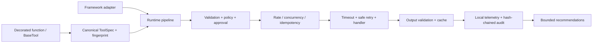

# ToolTether

[](ROADMAP.md)
[](https://github.com/zyadkandel295-source/tooltether/actions/workflows/ci.yml)
[](pyproject.toml)
[](LICENSE)

ToolTether is a local-first Python runtime for defining AI tools once and executing them consistently across explicitly supported framework adapters.

> **Alpha security warning:** ToolTether controls calls routed through it; it does not sandbox arbitrary Python code. Tool metadata is not a security boundary. Use process, container, VM, and operating-system isolation for untrusted code.

## Install

```bash
pip install tooltether
pip install "tooltether[mcp]"        # optional official MCP SDK
pip install "tooltether[langchain]"  # optional LangChain adapter
```

The first public alpha is packaged as `tooltether`. Confirm repository-owner approval before publishing a release.

## Five-minute quickstart

```python
from tooltether import Runtime, tool


@tool(cache=True, idempotent=True)
def add(a: int, b: int) -> int:
    """Add two integers."""
    return a + b


runtime = Runtime()
result = runtime.run(add, {"a": 2, "b": 3})
assert result.value == 5
```

Async handlers run natively:

```python
@tool(timeout=5, retries=2, idempotent=True)
async def lookup(query: str) -> list[str]:
    """Look up approved records."""
    return [query]


result = await runtime.arun(lookup, {"query": "safety"})
```

## Framework export

```python
openai_tool = add.export("openai")
anthropic_tool = add.export("anthropic")
mcp_tool = add.export("mcp")
langchain_tool = add.export("langchain", runtime=runtime)
```

All execution-capable adapters bind back to `Runtime`; validation, policy, audit, and telemetry are not bypassed.

## Permissions and approval

```python
from tooltether import NonInteractiveApprovalHandler, Policy, Runtime

policy = Policy()
policy.deny(capability="filesystem:delete", rule_id="no-delete")
policy.require_approval(tool="send_email", rule_id="approve-email")
runtime = Runtime(policy=policy, approval_handler=NonInteractiveApprovalHandler(allow=False))
```

## Execution policy

Use `ExecutionPolicy` to make trusted local execution versus restricted execution explicit. Restricted mode is a fail-closed in-process policy gate; it is not an OS sandbox.

```python
from tooltether import ExecutionMode, ExecutionPolicy, ExecutionPolicyError, Runtime, tool


@tool(side_effects="write", permissions=["records:write"])
def write_record() -> str:
    """Pretend to mutate an external record."""
    return "written"


runtime = Runtime(execution_policy=ExecutionPolicy(mode=ExecutionMode.RESTRICTED))
try:
    runtime.run(write_record, {})
except ExecutionPolicyError:
    print("restricted policy rejected write-like execution")
```

Safe read-only tools continue to run in restricted mode. Side-effecting, external-access, secret-requiring, high-risk, or raw callable execution must be explicitly allowed by the host application.

## Explainable optimization

```python
recommendations = await runtime.optimizer.recommend(add)
for recommendation in recommendations:
    print(recommendation.reason, recommendation.confidence)
```

The default mode is `recommend`. Automatic changes are bounded, fingerprint-scoped, and reversible. The runtime never fabricates semantic freshness or quality scores.

## Supported integrations

| Integration | Maturity | Recommended for alpha users | Current contract test | Limitation |
|---|---|---|---:|---|
| Python sync/async | Stable core | Yes | Pass | Sync work uses a worker thread in async execution |
| OpenAI tool schema/call mapping | Stable schema | Yes | Pass | No model loop or credentials in core |
| Anthropic client-tool schema/mapping | Stable schema | Yes | Pass | No model loop or credentials in core |
| MCP export/runtime server | Stable optional | Yes, when MCP extra is installed | MCP smoke pass | Transport authorization is host-owned |
| LangChain / LangGraph | Beta optional | Yes, with normal adapter caution | langchain-core sync/async pass | LangGraph use is via LangChain tools |
| CrewAI | Experimental | Not by default | Contract pass | Upstream custom-tool API may change |
| AutoGen | Experimental | Not by default | Contract pass | Cancellation mapping depends on caller integration |
| smolagents | Experimental | Not by default | Contract pass | Sync `forward`; process sandboxing remains external |

"Contract pass" means the adapter boundary is exercised without paid services. It does not claim live provider or all-version compatibility.

## Architecture



The core imports no provider or agent-framework SDK. Adapter imports are lazy and extras are explicit.

## What it does not solve

- In-process sandboxing of malicious Python tools.
- Authorization at remote providers or MCP transports.
- Semantic cache freshness without application signals.
- Legal or regulatory compliance by itself.
- A hosted dashboard, agent framework, model loop, or MCP protocol replacement.

## Performance and benchmarks

ToolTether adds a median runtime overhead of **~4.44 ms** (in-memory storage) and **~5.29 ms** (disk storage with WAL mode and `PRAGMA synchronous = NORMAL`).

Run the official benchmark suite:

```bash
python benchmarks/runtime_overhead.py
python benchmarks/release_smoke.py
python benchmarks/payload_scaling.py
python benchmarks/concurrency.py
python benchmarks/sustained_load.py
python benchmarks/cache.py
python benchmarks/storage.py
```

## Documentation and development

See the [full guide](docs/index.md), [threat model](docs/threat-model.md), [compatibility matrix](docs/compatibility.md), and [contribution guide](CONTRIBUTING.md).

```bash
python -m pytest
ruff check .
ruff format --check .
mypy src
python -m build
python -m twine check dist/*.whl dist/*.tar.gz
python scripts/validate_package.py
python scripts/installed_package_smoke.py dist/tooltether-0.1.0-py3-none-any.whl
```

For the full local release gate, run `python scripts/release_check.py`. The roadmap prioritizes real installed-SDK compatibility matrices, distributed backends, and deeper policy property tests. See [ROADMAP.md](ROADMAP.md).
